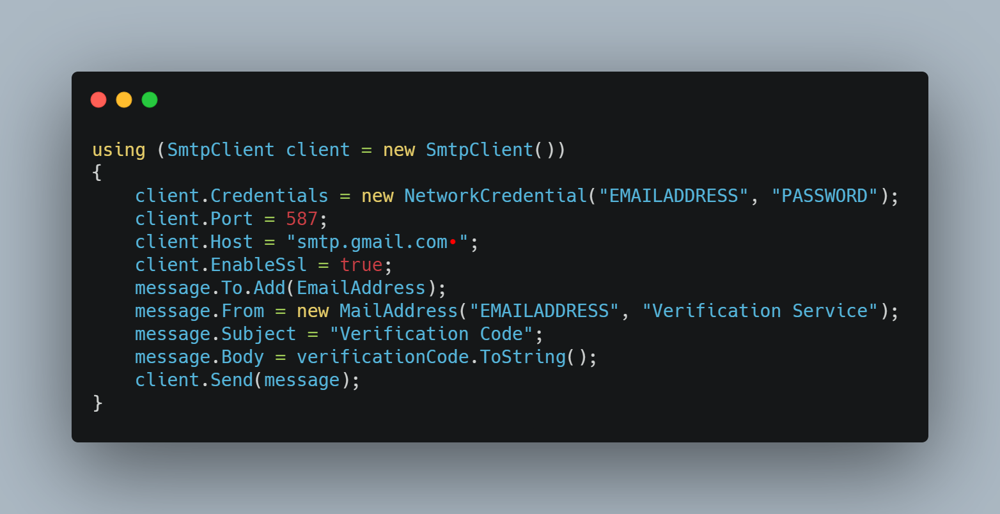
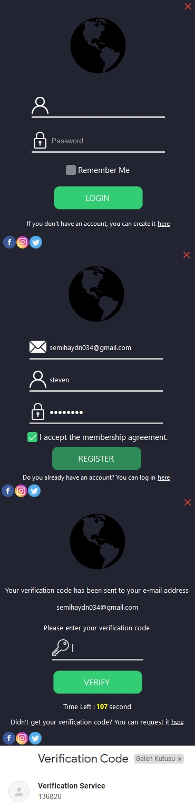

<!--
*** Semih Aydın 2020
-->

A Modern, stable and advanced login system.

## Visual Materials

[Bunifu UI](https://github.com/bunifu-framework) was used for the visual materials needed by this application.

## Other Information

*   In this application, user data is encrypted with **SHA256**.

    Encryption Example : steven | C7C084318B6F1BECE6F74FFCE1EA53596070345272DEE8040037497C7D4CBFFE
  
*   The mac address of the optional user is saved so that the user does not need to enter the verification code every time.

*   The user's login information and mac address are saved in the [SQLite](https://github.com/sqlite/sqlite) database.

## Important

If you want to test this application, you will need to enter your own email address and password in the corresponding fields in the VerificationService function.

The verification code that will be sent to the user during registration will be sent through the account you have entered.

From [here](https://github.com/semihaydin0/LoginSystem/blob/main/UserControls/Verification.cs#L68-L103) you can go to the code block in the screenshot.

If you're having a problem, [try](https://www.google.com/settings/security/lesssecureapps) allowing low-security applications to access the email account you entered.

## In-App Images

## Made With
*   C#

## Contributing
Pull requests are welcome. For major changes, please open an issue first to discuss what you would like to change.

## Contact
For any problems, you can contact me at the addresses below.
*   Discord: PHOENIX#7103
*   E-Mail: semihaydn034@gmail.com

## License
[MIT](https://choosealicense.com/licenses/mit/)
