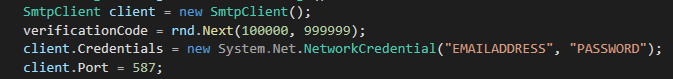
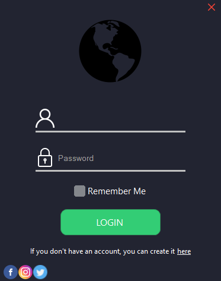
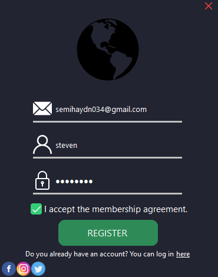
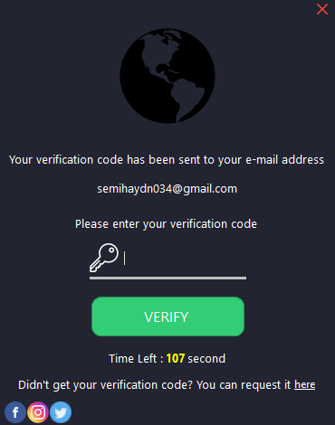
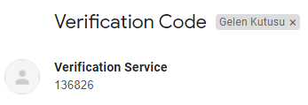

<!--
*** Semih Aydın 2020
-->

## Login System

A Modern, stable and advanced login system.

## Visual Materials

[Bunifu UI](https://github.com/bunifu-framework) was used in the construction of this application.

## Other Information

* In this application, user data is encrypted with **SHA256**.

  Encryption Example : steven | C7C084318B6F1BECE6F74FFCE1EA53596070345272DEE8040037497C7D4CBFFE

* User data is saved to a [SQLite](https://github.com/sqlite/sqlite) database.

## Important

If you want to test this application. You must enter your own email address and password in the line in the picture.

The verification system sends the verification code to the user via the e-mail address you have entered.

From [here](https://github.com/semihaydin0/LoginSystem/blob/main/UserControls/Verification.cs#L38) you can go to the code block in the screenshot.

Although you do all this, you get errors when sending a verification code.[Try](https://www.google.com/settings/security/lesssecureapps) allowing low-security applications access to the email account you have entered.

## In-App Images

## Made With
* C#

## Contact
For any problems, you can contact me at the addresses below.
* Discord : PHOENIX#7103
* E-Mail : semihaydn034@gmail.com

## License
[MIT](https://choosealicense.com/licenses/mit/)
